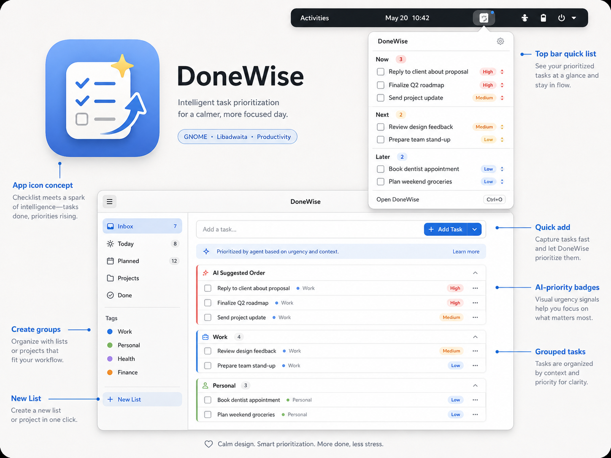

# DoneWise

Intelligent task prioritization for a calmer, more focused day.

DoneWise is a GNOME Shell extension: a top-bar checklist icon whose popup is
your whole todo world — tasks organised into **context groups** (a project,
"Errands", whatever fits), each group carrying a red / amber / green
**priority** accent. Tick tasks off in place, quick-add new ones, done.

Standalone, *you* create the groups and set their priorities. Optionally,
plug in an **AI agent** — any agent — and it names the groups, decides their
priorities, files every task, and keeps the order sensible, via a small open
REST contract. The app never knows which agent is behind the endpoint.



## How it fits together

```
┌─────────────┐   polls (GET /v1/board, ETag)   ┌──────────────┐   reads/PUTs   ┌──────────┐
│ GNOME       │ ───────────────────────────────▶│ provider     │◀───────────────│ AI agent │
│ extension   │ ◀─────────────────────────────── │ (adapter)    │  on its own    │ (yours)  │
│ (this repo) │   pushes adds + completions      └──────────────┘  schedule      └──────────┘
└─────────────┘
```

- The extension owns a local, reboot-surviving board
  (`~/.local/state/done-wise/board.json`); completed tasks purge on a rolling
  weekly cycle.
- The [provider contract](docs/provider-contract.md) is pull-based — a desktop
  is a poor server, so agents never push to it.
- The [reference adapter](adapter/) (Go, single binary, one JSON file) is the
  always-on middleman any agent operator can deploy; the
  [agent integration guide](docs/agent-integration-guide.md) is the whole
  "how to plug in your agent" story.
- Architecture & deployment scenarios (LAN cluster vs cloud VPS, with
  diagrams): [docs/architecture.md](docs/architecture.md).
- Full design: [docs/gnome-app-plan.md](docs/gnome-app-plan.md).

## Install (extension)

Requires GNOME Shell 46–50. Full walkthrough (including trying sync against a
locally-run adapter and a no-logout nested-shell option):
[docs/install-local.md](docs/install-local.md).

```sh
make install
# log out/in, then:
gnome-extensions enable done-wise@blackeyedhatman.com
```

Settings (⚙ in the popup): provider URL + app token (leave empty for
standalone use), poll interval, completed-task retention.

> The provider token is stored in dconf as plain text — fine for a home-lab
> shared secret; a libsecret move is a flagged future improvement.

## Develop

```sh
make test      # pure-logic unit tests (gjs)
make nested    # nested Wayland shell for manual testing
make pack      # build the installable zip into dist/
make test-adapter  # Go tests for the reference adapter
```

Logs: `journalctl -f -o cat /usr/bin/gnome-shell`.

## License

See [LICENSE](LICENSE).
