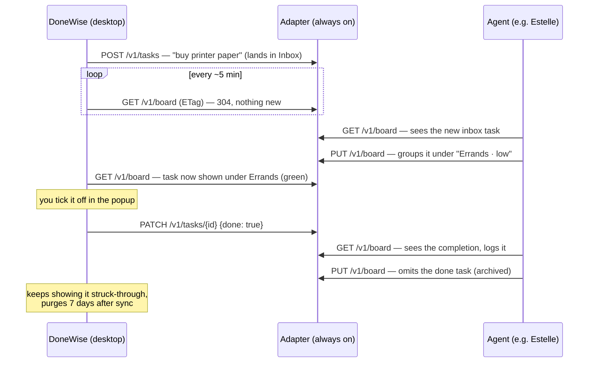
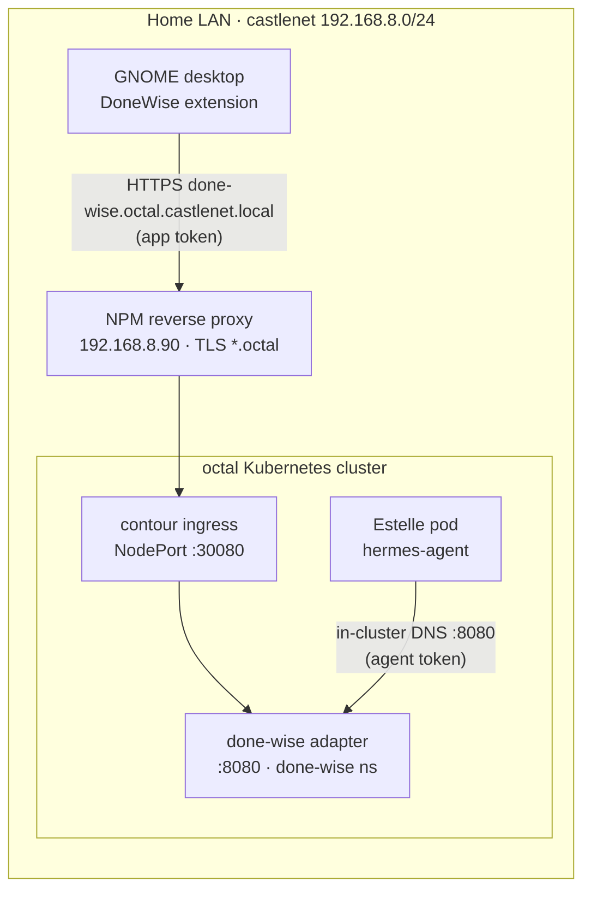
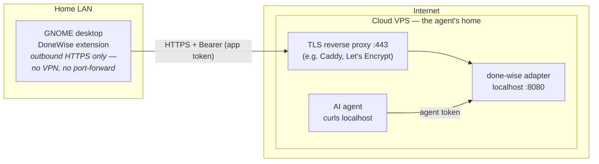

# DoneWise architecture — how the app, the adapter and the agent talk

Companion to the [provider contract](provider-contract.md). An editable
draw.io copy of these diagrams lives in [`architecture.drawio`](architecture.drawio).

## The three pieces

| Piece | What it is | Where it runs |
|---|---|---|
| **DoneWise app** | GNOME Shell extension; owns a local `board.json`, fully usable offline | your desktop |
| **Adapter** | the one always-on piece — a tiny web service ([`adapter/`](../adapter/)) holding the shared board: groups, priorities, done-flags | wherever the agent lives |
| **Agent** | Estelle today, anything tomorrow; visits the adapter on its own schedule and reorganises the board | octal cluster, a VPS, anywhere |

**DoneWise does not need the adapter to work.** Standalone, everything lives
on the desktop: add tasks, create groups, set red/amber/green priorities,
tick things off. The adapter only enters the picture when you want an AI
agent involved — paste its URL + token into the settings; clear the URL and
you are back to pure standalone.

## The one rule that makes every network scenario work

> Both the app and the agent dial **into** the adapter. Nothing ever dials
> the desktop (it may be asleep or off), and nothing dials the agent. The
> desktop therefore needs exactly one capability — outbound HTTPS — and it
> has that on any network, home or café.

Corollary: **the adapter lives where the agent lives.** Agent on the home
cluster → adapter on the home cluster. Agent on a cloud VPS → adapter on the
VPS. Moving the agent means changing one URL in the app's settings — nothing
else about the app changes, and nothing at home ever needs exposing.

## The conversation over a day

Resilience built into that flow:

- Desktop off or offline? Nothing is lost — the app queues its `POST`/`PATCH`
  calls locally and replays them before its next poll (creates are idempotent
  on the task id, so replays are safe).
- Agent never shows up? The app keeps working standalone; new tasks simply
  stay in the Inbox.
- Authority is enforced by the adapter: the app owns done-state and task
  creation; the agent owns grouping, group names/priorities, ordering and
  titles. `base_revision` protects tasks added while the agent was thinking.

## Scenario A — agent on the home cluster

Everything stays inside the LAN; nothing is exposed to the internet. The
adapter deploys in its own `done-wise` namespace via ArgoCD (see
[deploy-octal.md](deploy-octal.md)) and the agent curls it over in-cluster DNS.

> Deployment note (July 2026): the NPM proxy needs a host entry for the
> `done-wise.octal…` hostname when the adapter is deployed — probing showed
> `*.octal` names without an entry land on the NPM default page.
> `kubectl port-forward` works as a testing fallback.

## Scenario B — agent in the cloud (a VPS)

The adapter moves with the agent; the desktop polls out over the internet
exactly as it polled the LAN.

Two clean ways for the desktop to reach a VPS adapter — pick one:

1. **Public URL with a domain (conventional).** Point a subdomain at the VPS,
   run a TLS reverse proxy (Caddy auto-provisions Let's Encrypt certificates)
   in front of the adapter, put that URL in the app's settings. Security
   posture: TLS for transport; the two bearer tokens are the gate — make them
   long and random, they are the *only* gate. The exposed surface is a
   five-endpoint Go binary whose entire dataset is a todo list. Optional
   hardening at the proxy: IP allowlist, rate limiting. Works from any
   network the desktop happens to be on.
2. **Tailscale (nothing public at all).** VPS and desktop join the same
   tailnet; the app uses the VPS's tailnet/MagicDNS address and no port is
   open to the internet — WireGuard encrypts the path, so TLS is optional.
   Trade-offs: every machine running DoneWise must join the tailnet, and
   sync depends on `tailscaled` running.

The inverse layout — adapter at home, agent in the cloud — is possible but
worse: the cloud agent would need a route *into* the LAN (VPN or
port-forward), and todo sync would break whenever the home link is down.
Only consider it if the agent must stay glued to on-LAN data.
